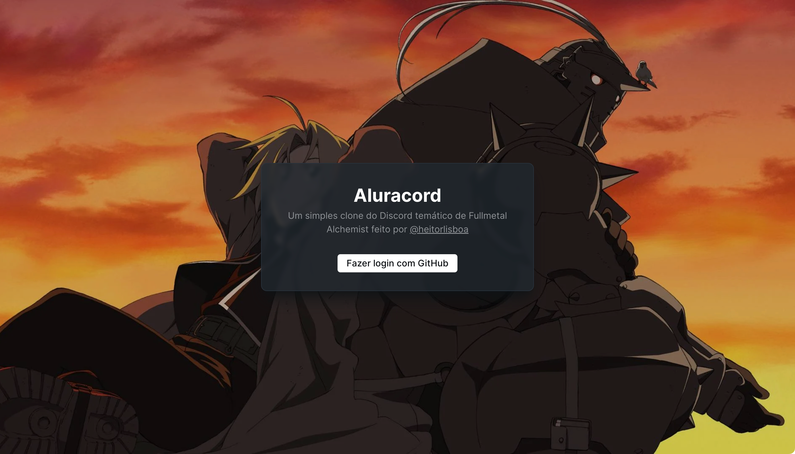
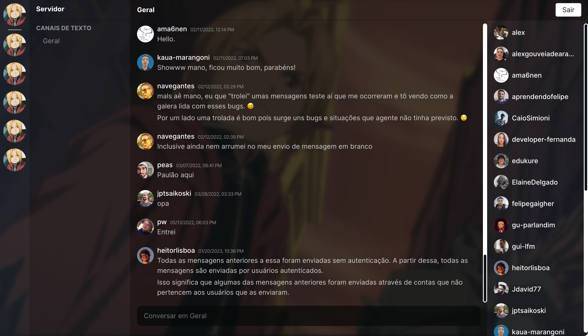
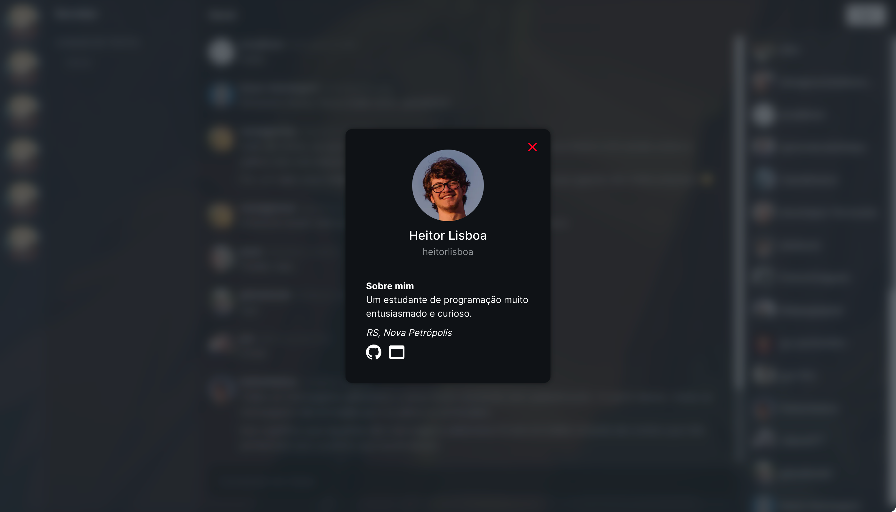
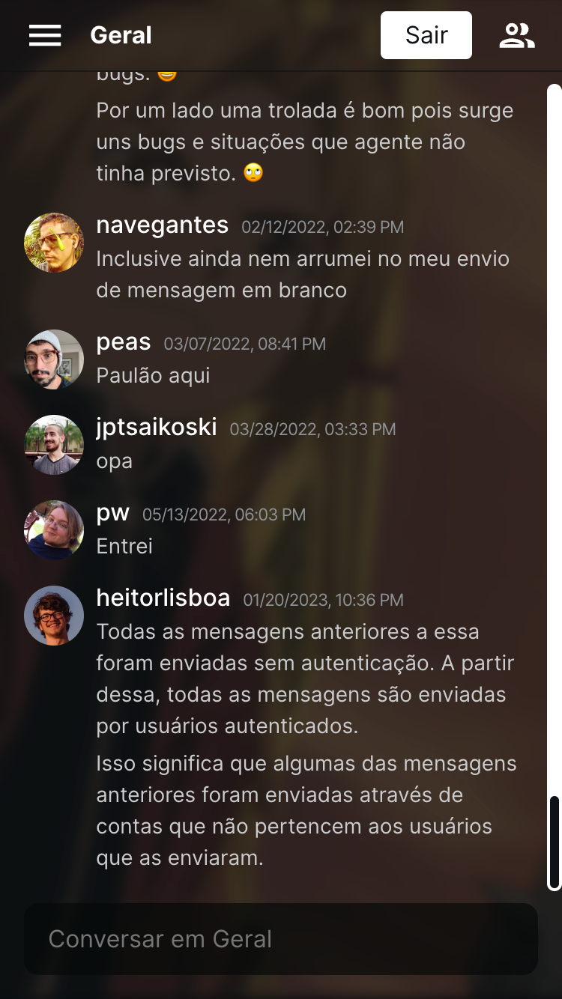
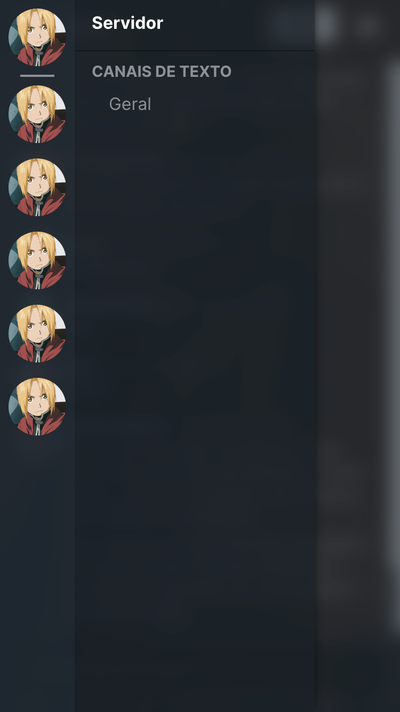
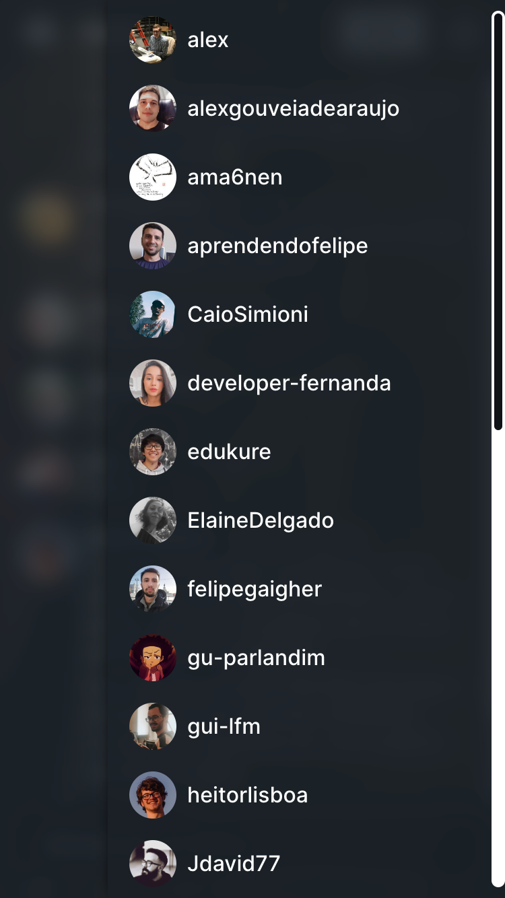

# Aluracord

O Aluracord é um clone básico do Discord, que fiz com temática de Fullmetal Alchemist, criado durante a primeira Imersão React de 2022 da Alura.

O objetivo dessa imersão foi de dar uma introdução ao Next.js e ao Supabase (um back-end as a service). Para isso, foi proposta a construção de uma aplicação fullstack de chat em tempo real.

Inicialmente o projeto foi desenvolvido durante a imersão, porém mesmo após o término do evento eu eventualmente faço modificações e melhorias, assim, à medida que meu conhecimento se expande, a qualidade da aplicação aumenta.

Link para o website: [https://aluracord-heitorlisboa.vercel.app](https://aluracord-heitorlisboa.vercel.app)

## 👨‍💻 Tecnologias/serviços utilizados

- [React](https://reactjs.org)
- [Next.js](https://nextjs.org)
- [TypeScript](https://www.typescriptlang.org)
- [Sass](https://sass-lang.com)
- [Supabase](https://supabase.com)
- [GitHub OAuth](https://docs.github.com/pt/developers/apps/building-oauth-apps/creating-an-oauth-app) (provedor de autenticação)

## ✨ Destaques

- Chat em tempo real
- Login com GitHub
- Interface acessível e intuitiva
- Server Side Rendering

## 📷 Capturas de tela

  

Página inicial

 

  

Página de chat

 

  

Modal de perfil de usuário

 

  

Layout mobile

 

  

Menu de navegação mobile aberto

 

  

Menu de lista de usuários mobile aberto

## 📄 Licença

Esse projeto utiliza a licença GNU GPL-3.0 &ndash; veja o arquivo [`COPYING`](COPYING) para mais detalhes.

Em resumo: é uma licença que permite fazer quase tudo com o projeto, com exceção de distribuir versões de código fechado (closed source).
